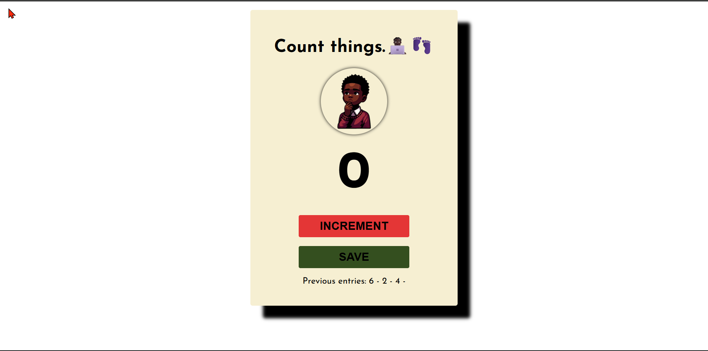

## Table of contents

- [Table of contents](#table-of-contents)
- [Overview](#overview)
  - [Screenshot](#screenshot)
  - [Links](#links)
- [My process](#my-process)
  - [Built with](#built-with)
  - [Useful resources](#useful-resources)
- [Author](#author)

## Overview

### Screenshot

### Links

- Solution URL: [View the source code.](https://github.com/jidoG8/COUNT-THINGS.git)
- Live Site URL: [Checkout the live preview.](https://jidog8.github.io/FOUR-CARD-FEATURE-DESIGN/)

## My process

### Built with

- Semantic HTML5 markup
- CSS custom properties
- Javascript

### Useful resources

- [SCRIMBA](https://v1.scrimba.com/learn/learnjavascript/deploy-with-netlify-cwGp4RcJ) - Taught me a bench of new things to do in Javascript

## Author

- Frontend Mentor - [@jidoG8](https://www.frontendmentor.io/profile/jidoG8)
- Twitter - [@OjjaC1253](https://x.com/OjjaC1253)
- LinkedIn - [@ojja-caesar](https://www.linkedin.com/in/ojja-caesar-134980345/)
